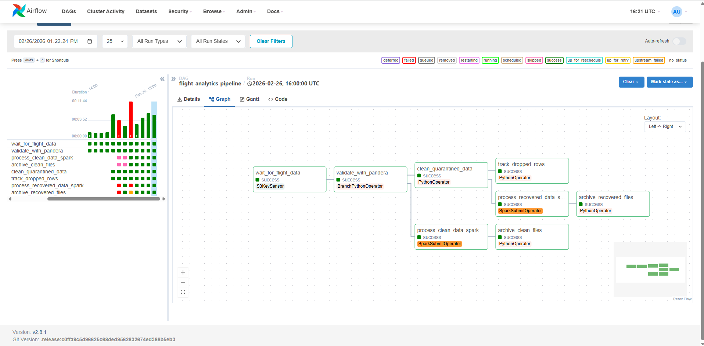
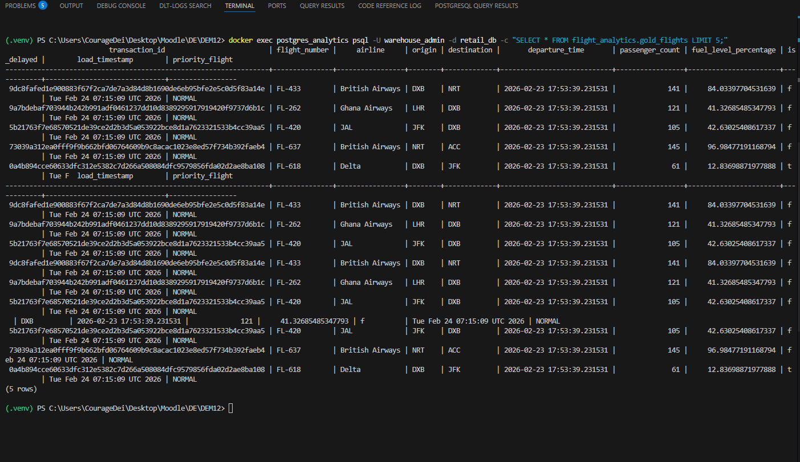
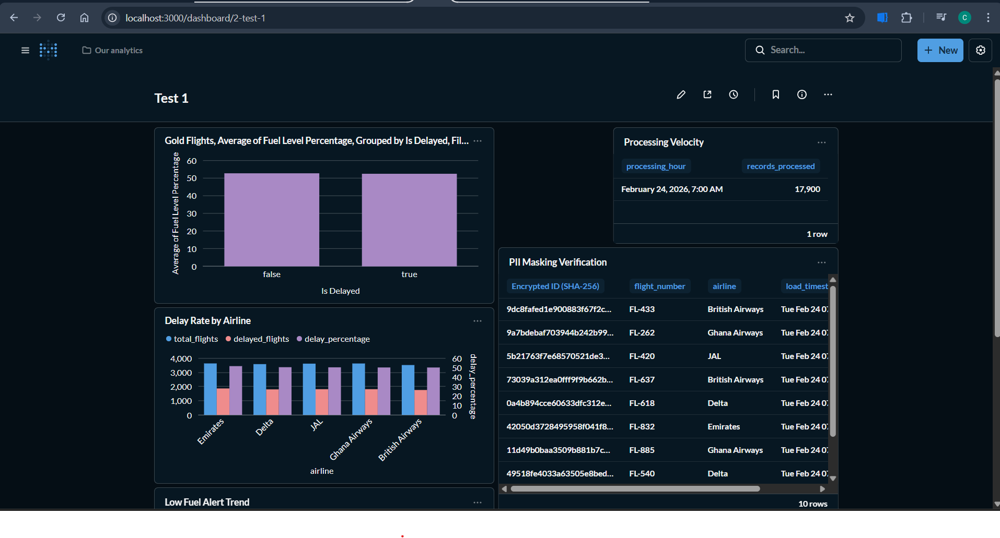
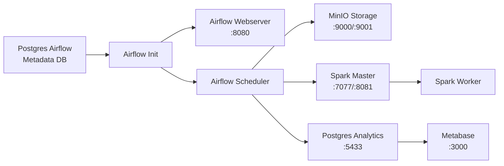

# ✈️ Flight Intelligence Platform

> **A production-grade, end-to-end data engineering platform** that ingests synthetic flight data, validates it against strict quality contracts, transforms it with Apache Spark, and serves analytical insights through Metabase dashboards — all orchestrated by Apache Airflow inside a fully containerized Docker environment.


---

## 📸 Screenshots

<!-- Replace these placeholders with actual screenshot paths -->

### Airflow DAG Overview


### Analytics Pipeline Graph View



### Spark Master UI — Job Execution


### MinIO Object Storage — Raw Data Bucket


### PostgreSQL Analytics Warehouse — Gold Table



### Metabase Dashboard — Flight Analytics



### CI/CD Pipeline — GitHub Actions


---

### System Architecture


---

## 🔧 Technology Stack

| Layer                | Technology           | Purpose                                                      |
| -------------------- | -------------------- | ------------------------------------------------------------ |
| **Orchestration**    | Apache Airflow 2.8.1 | DAG scheduling, task execution, monitoring                   |
| **Processing**       | Apache Spark 3.5.0   | Distributed data transformation (PySpark)                    |
| **Data Quality**     | Pandera              | Schema-based DataFrame validation                            |
| **Object Storage**   | MinIO                | S3-compatible storage for raw & processed data               |
| **Data Warehouse**   | PostgreSQL 16        | Analytical data store (gold layer)                           |
| **Visualization**    | Metabase             | Business intelligence dashboards                             |
| **Containerization** | Docker Compose       | Multi-service orchestration (9 services)                     |
| **CI/CD**            | GitHub Actions       | Automated linting, testing, and Docker builds                |
| **Data Generation**  | Python / Faker       | Synthetic flight data with configurable dirty-data injection |

---

## 📂 Project Structure

```
Flight-Intelligence-Platform/
├── airflow/
│   └── dags/
│       ├── raw_ingestion_dag.py          # DAG 1: Local files → MinIO
│       └── flight_analytics_pipeline.py  # DAG 2: MinIO → Validate → Spark → Postgres
├── spark/
│   ├── jobs/
│   │   └── process_flights.py            # PySpark ETL: transform & load to warehouse
│   ├── schemas/
│   │   └── flight_schema.py              # Pandera DataFrameModel for validation
│   └── jars/
│       └── postgresql-42.7.6.jar         # JDBC driver for Postgres connectivity
├── scripts/
│   └── flight_generator.py               # Synthetic data generator with dirty-data modes
├── tests/
│   ├── test_flight_generator.py          # 10 tests: structure, quality, edge cases
│   ├── test_flight_schema.py             # 8 tests: valid/invalid schema validation
│   └── test_dag_integrity.py             # 6 tests: DAG structure (requires Airflow)
├── .github/workflows/
│   ├── ci_cd.yml                         # Full CI/CD: lint → test → Docker build
│   └── ci_basic.yml                      # Lightweight CI pipeline
├── docker-compose.yml                    # 9-service infrastructure definition
├── Dockerfile                            # Custom Airflow image with Java (for Spark)
├── requirements.txt                      # Python dependencies
├── user_guide.md                         # Step-by-step operational guide
└── .env                                  # Environment variables (credentials, config)
```

---

## 🚀 Pipeline Overview

The platform runs **two decoupled DAGs** that operate independently, connected only through MinIO as a shared data layer:

### DAG 1 — Raw Ingestion Pipeline

**Purpose:** Move local CSV files into cloud-compatible object storage.

```
wait_for_local_file → upload_files_to_minio
```

| Task                    | Operator         | Description                                                     |
| ----------------------- | ---------------- | --------------------------------------------------------------- |
| `wait_for_local_file`   | `PythonSensor`   | Polls `data/` for `flights_*.csv` files every 30s               |
| `upload_files_to_minio` | `PythonOperator` | Uploads each CSV to MinIO `raw-data` bucket, deletes local copy |

---

### DAG 2 — Flight Analytics Pipeline

**Purpose:** Validate, transform, and load data into the analytics warehouse.

```
wait_for_flight_data → validate_with_pandera → process_flight_data_spark → archive_processed_files
```

| Task                        | Operator              | Description                                                             |
| --------------------------- | --------------------- | ----------------------------------------------------------------------- |
| `wait_for_flight_data`      | `S3KeySensor`         | Waits for CSV files to appear in MinIO `raw-data` bucket                |
| `validate_with_pandera`     | `PythonOperator`      | Validates every CSV against `FlightSchema`; quarantines bad files       |
| `process_flight_data_spark` | `SparkSubmitOperator` | Submits PySpark job to Spark cluster for transformation & Postgres load |
| `archive_processed_files`   | `PythonOperator`      | Moves processed files from `raw-data/` to `archived/` in MinIO          |

---

## 🛡️ Data Quality Gate

The platform enforces **strict data contracts** using Pandera before any data reaches Spark or Postgres. This prevents bad data from polluting the analytics warehouse.

### Schema Contract (`FlightSchema`)

```python
class FlightSchema(pa.DataFrameModel):
    transaction_id:       Series[str]   = pa.Field(unique=True)
    flight_number:        Series[str]   = pa.Field(str_startswith="FL-")
    airline:              Series[str]
    origin:               Series[str]   = pa.Field(str_length=3)
    destination:          Series[str]   = pa.Field(str_length=3)
    departure_time:       Series[str]
    passenger_count:      Series[int]   = pa.Field(ge=0, le=850)
    fuel_level_percentage: Series[float] = pa.Field(ge=0.0, le=100.0)
    is_delayed:           Series[bool]
```

**Validation behavior:**

- Uses `lazy=True` for comprehensive error reporting (all violations, not just the first)
- Clean files → moved to `validated/` prefix in MinIO
- Bad files → quarantined to `quarantine/` prefix with error log
- If **any** file fails → DAG fails, Spark never runs

---

## ⚡ Spark Transformation

The `process_flights.py` PySpark job applies cybersecurity and analytics transformations:

| Transformation              | Description                                            |
| --------------------------- | ------------------------------------------------------ |
| **Transaction ID Hashing**  | SHA-256 hash of `transaction_id` for PII protection    |
| **Load Timestamp**          | Adds `load_timestamp` column for data lineage tracking |
| **Priority Classification** | Flags flights with >250 passengers as `HIGH` priority  |

The transformed data is written to `flight_analytics.gold_flights` in PostgreSQL using JDBC.

---

## 🐳 Docker Infrastructure

The platform runs as **9 Docker services** on a single bridge network:



---

## ✅ Testing Strategy

The project includes **26 automated tests** across three test modules:

| Test File                  | Tests | Scope                                                                                         |
| -------------------------- | ----- | --------------------------------------------------------------------------------------------- |
| `test_flight_generator.py` | 10    | Data structure, column presence, value ranges, dirty-data injection, uniqueness               |
| `test_flight_schema.py`    | 8     | Valid data passes, negative fuel fails, passengers out-of-range, missing columns, bad formats |
| `test_dag_integrity.py`    | 6     | DAG loading, task presence, dependency chains (auto-skipped without Airflow)                  |

Run tests:

```bash
pytest tests/ -v
```

---

## 🔄 CI/CD Pipeline

The GitHub Actions workflow runs automatically on every push/PR to `main`:
```
| Job              | Steps                                                              |
| ---------------- | ------------------------------------------------------------------ |
| **Lint & Test**  | Checkout → Python 3.10 setup → Install deps → flake8 lint → pytest |
| **Docker Build** | Checkout → `docker build` to validate the image compiles           |

---

## 🗄️ Data Flow Summary

```
   DATA GENERATOR                AIRFLOW                    SPARK                  WAREHOUSE
  ┌──────────────┐          ┌──────────────────┐      ┌──────────────┐      ┌──────────────────┐
  │   CSV files   │──local──▶│  DAG 1: Ingest   │      │  PySpark ETL │      │   PostgreSQL     │
  │  (data/)      │          │  data/ → MinIO   │      │  - Hash PIIs │      │                  │
  └──────────────┘          └────────┬─────────┘      │  - Timestamp │      │  flight_analytics│
                                     │                 │  - Classify  │      │  .gold_flights   │
                            ┌────────▼─────────┐      └───────┬──────┘      └────────┬─────────┘
                            │  DAG 2: Validate  │             │                      │
                            │  Pandera QA Gate  │─── PASS ───▶│──── JDBC Write ─────▶│
                            │                   │             │                      │
                            │  quarantine/ ◄────│─── FAIL                            ▼
                            └──────────────────┘                             ┌──────────────────┐
                                                                             │    Metabase       │
                                                                             │   (Dashboards)   │
                                                                             └──────────────────┘
```

---

## 📊 Sample Data Schema

| Column                  | Type   | Constraints       | Example               |
| ----------------------- | ------ | ----------------- | --------------------- |
| `transaction_id`        | string | unique            | `a1b2c3d4-e5f6-...`   |
| `flight_number`         | string | starts with `FL-` | `FL-1234`             |
| `airline`               | string | —                 | `Emirates`            |
| `origin`                | string | exactly 3 chars   | `DXB`                 |
| `destination`           | string | exactly 3 chars   | `JFK`                 |
| `departure_time`        | string | —                 | `2026-02-24 08:30:00` |
| `passenger_count`       | int    | 0–850             | `312`                 |
| `fuel_level_percentage` | float  | 0.0–100.0         | `87.5`                |
| `is_delayed`            | bool   | —                 | `True`                |

---

## 🔐 Security Considerations

- **PII Hashing**: Transaction IDs are SHA-256 hashed before reaching the warehouse
- **Schema Enforcement**: Pandera's `strict=True` mode rejects unexpected columns
- **Network Isolation**: All services communicate over an internal Docker bridge network
- **Credential Management**: Environment variables via `.env` file (never committed to Git)

---

## 📝 Key Design Decisions

1. **Decoupled DAG Architecture** — Ingestion and processing are separate DAGs, enabling independent scheduling and failure isolation
2. **Data Quality Gate Before Processing** — Pandera validation runs _before_ Spark, preventing bad data from ever reaching the warehouse
3. **Schema Separation in Postgres** — Analytics data lives in the `flight_analytics` schema, isolated from Metabase's internal metadata tables
4. **Dirty Data Injection** — The generator alternates between clean and dirty batches (10 clean, 2 dirty) to continuously test the quality gate
5. **Graceful Test Skipping** — DAG integrity tests auto-skip in CI/CD environments where Airflow isn't installed

---

## 📚 Additional Documentation

- **[User Guide](user_guide.md)** — Complete step-by-step commands for running the project from setup to teardown

---

## 👤 Author

**Jill** — Data Engineering Student

---

## 📄 License

This project is developed for educational purposes as part of the DEM12 module.
