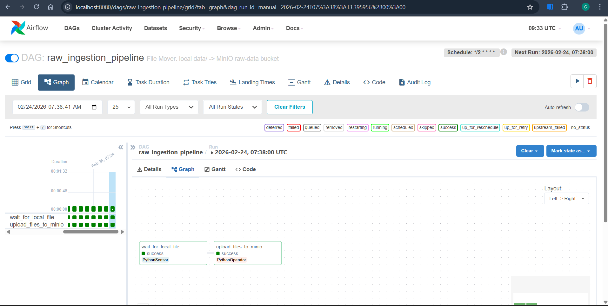
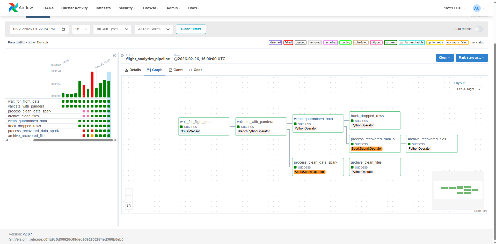
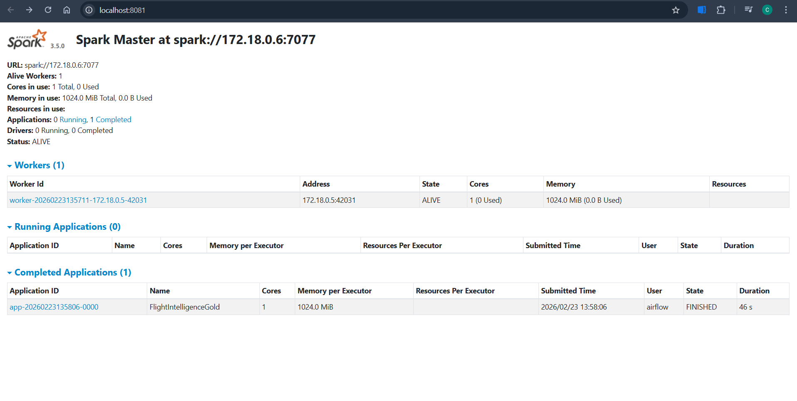
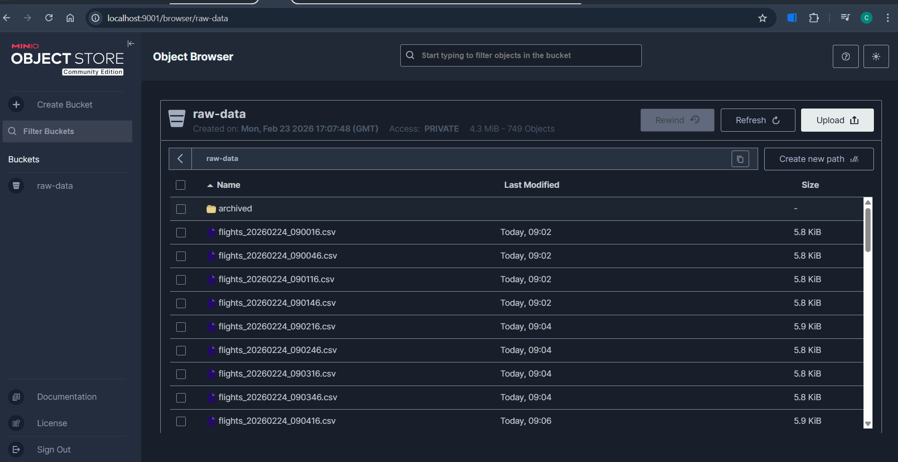
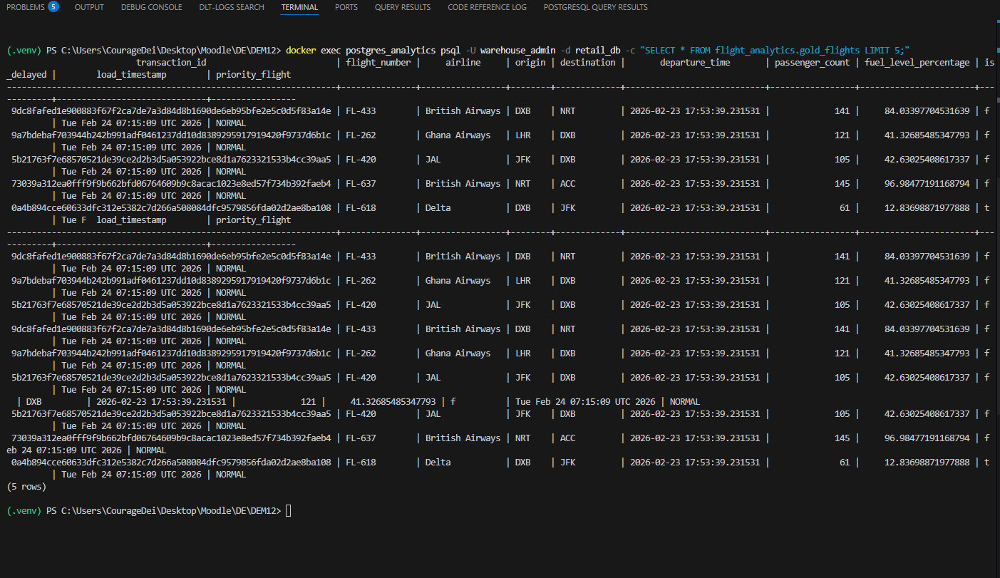
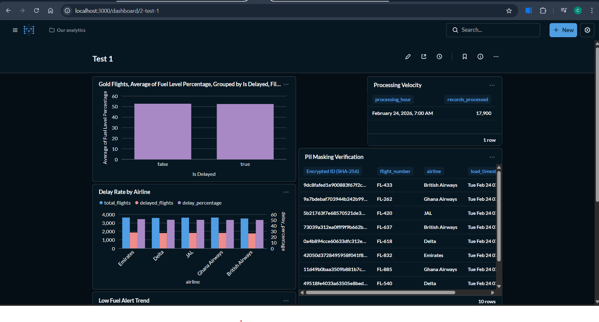
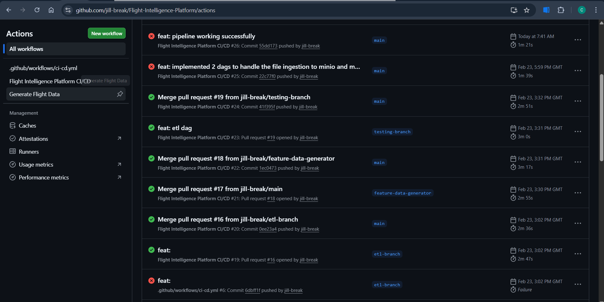
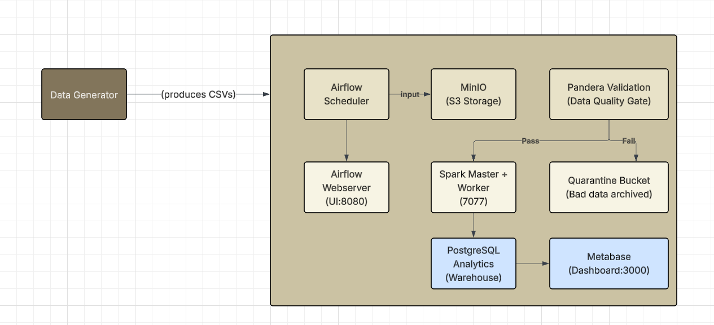
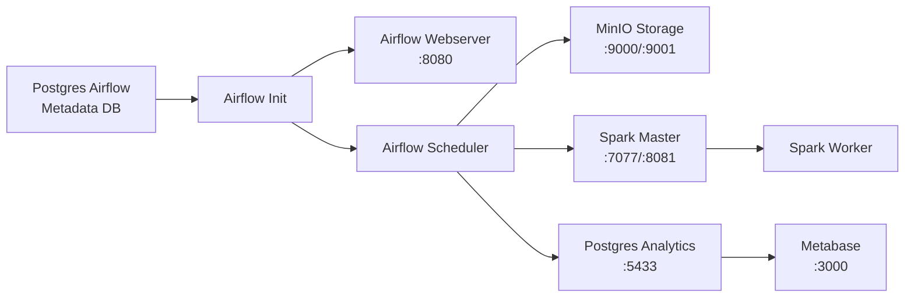

#  Flight Intelligence Platform

> **An end-to-end data engineering platform** that ingests synthetic flight data, validates it against strict quality contracts, transforms it with Apache Spark, and serves analytical insights through Metabase dashboards — all orchestrated by Apache Airflow inside a fully containerized Docker environment.


---

## Screenshots

### Airflow DAG Overview



### Analytics Pipeline Graph View



### Spark Master UI — Job Execution



### MinIO Object Storage — Raw Data Bucket



### PostgreSQL Analytics Warehouse — Gold Table



### Metabase Dashboard — Flight Analytics



### CI/CD Pipeline — GitHub Actions



---

### System Architecture


---

## Technology Stack

| Layer                | Technology           | Purpose                                                      |
| -------------------- | -------------------- | ------------------------------------------------------------ |
| **Orchestration**    | Apache Airflow 2.8.1 | DAG scheduling, task execution, monitoring                   |
| **Processing**       | Apache Spark 3.5.0   | Distributed data transformation (PySpark)                    |
| **Data Quality**     | Pandera              | Schema-based DataFrame validation                            |
| **Object Storage**   | MinIO                | S3-compatible storage for raw & processed data               |
| **Data Warehouse**   | PostgreSQL 16        | Analytical data store (gold layer)                           |
| **Visualization**    | Metabase             | Business intelligence dashboards                             |
| **Containerization** | Docker Compose       | Multi-service orchestration (9 services)                     |
| **CI/CD**            | GitHub Actions       | Automated linting, testing, and Docker builds                |
| **Data Generation**  | Python / Faker       | Synthetic flight data with configurable dirty-data injection. |

---

## Project Structure.

```
Flight-Intelligence-Platform/
├── airflow/
│   └── dags/
│       ├── raw_ingestion_dag.py          # DAG 1: Local files → MinIO
│       ├── flight_analytics_pipeline.py  # DAG 2: MinIO → Validate → Clean → Spark → Postgres
│       └── quarantine_cleaner.py         # 11-step pure python logic for recovering quarantined data
├── spark/
│   ├── jobs/
│   │   └── process_flights.py            # PySpark ETL: transform & load to warehouse
│   ├── schemas/
│   │   └── flight_schema.py              # Pandera DataFrameModel for validation
│   └── jars/
│       └── postgresql-42.7.6.jar         # JDBC driver for Postgres connectivity
├── scripts/
│   └── flight_generator.py               # Synthetic data generator with dirty-data modes
├── tests/
│   ├── test_flight_generator.py          # 10 tests: structure, quality, edge cases
│   ├── test_flight_schema.py             # 8 tests: valid/invalid schema validation
│   ├── test_quarantine_cleaner.py        # 21 tests: numeric clamping, UUID validation, etc.
│   └── test_dag_integrity.py             # 7 tests: DAG structure (requires Airflow)
├── .github/
│   ├── workflows/
│   │   ├── ci_cd.yml                     # Full CI/CD: lint → test → coverage → Docker build
│   │   ├── ci_basic.yml                  # Manual flight data generation
│   │   ├── ci_integration.yml            # Docker Compose integration test
│   │   ├── ci_security.yml               # pip-audit vulnerability scanning
│   │   ├── ci_docs.yml                   # Auto-generate API docs → GitHub Pages
│   │   ├── ci_data_quality.yml           # Scheduled weekly data quality report
│   │   └── release.yml                   # Tag-based release automation
│   └── dependabot.yml                    # Automated dependency update PRs
├── docker-compose.yml                    # 9-service infrastructure definition
├── Dockerfile                            # Custom Airflow image with Java (for Spark)
├── requirements.txt                      # Python dependencies
├── user_guide.md                         # Step-by-step operational guide
├── CONTRIBUTING.md                       # Development workflow & branch protection
└── .env                                  # Environment variables (credentials, config)
```

---

## Pipeline Overview

The platform runs **two decoupled DAGs** that operate independently, connected only through MinIO as a shared data layer:

### DAG 1 — Raw Ingestion Pipeline

**Purpose:** Move local CSV files into cloud-compatible object storage.

```
wait_for_local_file → upload_files_to_minio
```

| Task                    | Operator         | Description                                                     |
| ----------------------- | ---------------- | --------------------------------------------------------------- |
| `wait_for_local_file`   | `PythonSensor`   | Polls `data/` for `flights_*.csv` files every 30s               |
| `upload_files_to_minio` | `PythonOperator` | Uploads each CSV to MinIO `raw-data` bucket, deletes local copy |

---

### DAG 2 — Flight Analytics Pipeline (Parallel Processing)

**Purpose:** Validate, rescue dirty data, transform, and load into the analytics warehouse.

```
wait_for_flight_data → validate_with_pandera ─┬─→ process_clean_data_spark ─────→ archive_clean_files
                                              │
                                              └─→ clean_quarantined_data ─┬─→ track_dropped_rows
                                                                          │
                                                                          └─→ process_recovered_data_spark ─→ archive_recovered_files
```

| Task | Operator | Description |
| --- | --- | --- |
| `wait_for_flight_data` | `S3KeySensor` | Waits for CSV files to appear in MinIO `raw-data` bucket |
| `validate_with_pandera` | `BranchPythonOperator` | Validates every CSV against `FlightSchema`; branches to clean and/or quarantine processing |
| `process_clean_data_spark` | `SparkSubmitOperator` | Parallel Spark job processing 100% clean data completely independently |
| `clean_quarantined_data` | `PythonOperator` | Applies 11-step fix (whitespace stripping, clamping) to quarantine files |
| `track_dropped_rows` | `PythonOperator` | Logs unrecoverable rows to MinIO `dropped-rows/` and Postgres `quarantine_log` |
| `process_recovered_data_spark` | `SparkSubmitOperator` | Parallel Spark job processing data that has been recovered from quarantine |
| `archive_*_files` | `PythonOperator` | Moves processed files to `archived/` (independent archiving for clean/recovered) |

---

**Validation & Quarantine behavior:**

- Uses `lazy=True` for comprehensive error reporting (all violations are caught)
- Valid files are immediately routed to `validated/clean/` for fast-track Spark processing.
- If **any** row in a file fails, the **entire file** is routed to `quarantine/`.
- The quarantine cleaner attempts data recovery (re-typing, clamping, whitespace trimming).
- Recovered rows hit a second parallel Spark job via `validated/recovered/`, ensuring clean data is never blocked by dirty data.

---

## Spark Transformation

The `process_flights.py` PySpark job applies cybersecurity and analytics transformations:

| Transformation              | Description                                            |
| --------------------------- | ------------------------------------------------------ |
| **Transaction ID Hashing**  | SHA-256 hash of `transaction_id` for PII protection    |
| **Load Timestamp**          | Adds `load_timestamp` column for data lineage tracking |
| **Priority Classification** | Flags flights with >250 passengers as `HIGH` priority  |

The transformed data is written to `flight_analytics.gold_flights` in PostgreSQL using JDBC.

---

## Docker Infrastructure

The platform runs as **9 Docker services** on a single bridge network:


```mermaid
graph LR
    A[Postgres Airflow<br/>Metadata DB] --> B[Airflow Init]
    B --> C[Airflow Webserver<br/>:8080]
    B --> D[Airflow Scheduler]
    D --> E[MinIO Storage<br/>:9000/:9001]
    D --> F[Spark Master<br/>:7077/:8081]
    F --> G[Spark Worker]
    D --> H[Postgres Analytics<br/>:5433]
    H --> I[Metabase<br/>:3000]
```

---

##  Testing Strategy

The project includes **46 automated tests** across four test modules achieving high test coverage:

| Test File                  | Tests | Scope                                                                                         |
| -------------------------- | ----- | --------------------------------------------------------------------------------------------- |
| `test_flight_generator.py` | 10    | Data structure, column presence, value ranges, dirty-data injection, uniqueness               |
| `test_flight_schema.py`    | 8     | Valid data passes, negative fuel fails, passengers out-of-range, missing columns, bad formats |
| `test_quarantine_cleaner.py`| 21   | Quarantine fixes (clamping, UUIDs, logical inconsistencies, nulls, whitespace, dropping)      |
| `test_dag_integrity.py`    | 7     | DAG loading, task presence, valid python parsing (auto-skipped without Airflow)               |

Run tests:

```bash
pytest tests/ -v
```

---

## CI/CD Pipeline

The project uses **7 GitHub Actions workflows** for automated quality assurance, security, and operations:

| Workflow | Trigger | Purpose |
|----------|---------|--------|
| `ci_cd.yml` | Push/PR to `main` | Lint (flake8) → Schema validation → Test with coverage (Python 3.10 & 3.11) → Docker build |
| `ci_basic.yml` | Manual dispatch | Generate synthetic flight data and commit to repo |
| `ci_integration.yml` | Push to `main` | Docker Compose health check for core services (Postgres, MinIO, Spark) |
| `ci_security.yml` | Push/PR to `main` | `pip-audit` dependency vulnerability scan |
| `ci_docs.yml` | Push to `main` | Auto-generate API documentation with `pdoc` → deploy to GitHub Pages |
| `ci_data_quality.yml` | Weekly (Mon 9AM UTC) | Scheduled data quality report with schema validation |
| `release.yml` | Tag push (`v*`) | Auto-generate changelog and create GitHub Release |

> **Note:** To optimize CI resource usage, workflows triggered by pushes or pull requests (`ci_cd.yml`, `ci_integration.yml`, `ci_docs.yml`) are configured with `paths-ignore` to skip execution if changes only affect non-code files (such as Markdown documentation, `docs/`, `LICENSE`, or `.gitignore`).

**Dependabot** is also configured to automatically create PRs for vulnerable Python dependencies and outdated GitHub Actions versions on a weekly schedule.

For development workflow and branch protection rules, see **[CONTRIBUTING.md](CONTRIBUTING.md)**.

---

## Sample Data Schema

| Column                  | Type   | Constraints       | Example               |
| ----------------------- | ------ | ----------------- | --------------------- |
| `transaction_id`        | string | unique            | `a1b2c3d4-e5f6-...`   |
| `flight_number`         | string | starts with `FL-` | `FL-1234`             |
| `airline`               | string | —                 | `Emirates`            |
| `origin`                | string | exactly 3 chars   | `DXB`                 |
| `destination`           | string | exactly 3 chars   | `JFK`                 |
| `departure_time`        | string | —                 | `2026-02-24 08:30:00` |
| `passenger_count`       | int    | 0–850             | `312`                 |
| `fuel_level_percentage` | float  | 0.0–100.0         | `87.5`                |
| `is_delayed`            | bool   | —                 | `True`                |

---

## Security Considerations

- **PII Hashing**: Transaction IDs are SHA-256 hashed before reaching the warehouse
- **Schema Enforcement**: Pandera's `strict=True` mode rejects unexpected columns
- **Network Isolation**: All services communicate over an internal Docker bridge network
- **Credential Management**: Environment variables via `.env` file (never committed to Git)

---

## Key Design Decisions

1. **Decoupled DAG Architecture** — Ingestion and processing are separate DAGs, enabling independent scheduling and failure isolation
2. **Data Quality Gate Before Processing** — Pandera validation runs _before_ Spark, preventing bad data from ever reaching the warehouse
3. **Schema Separation in Postgres** — Analytics data lives in the `flight_analytics` schema, isolated from Metabase's internal metadata tables
4. **Dirty Data Injection** — The generator alternates between clean and dirty batches (10 clean, 2 dirty) to continuously test the quality gate
5. **Graceful Test Skipping** — DAG integrity tests auto-skip in CI/CD environments where Airflow isn't installed

---

##  Additional Documentation

- **[User Guide](user_guide.md)** — Complete step-by-step commands for running the project from setup to teardown

